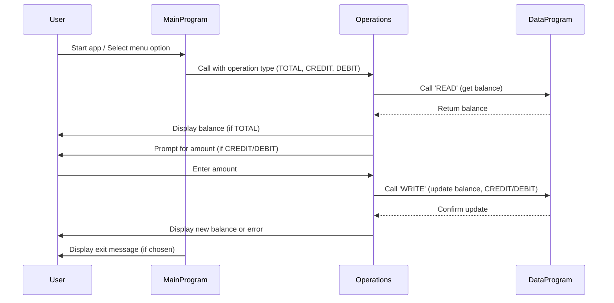

# COBOL Student Account System Documentation

This project manages student accounts using COBOL programs. Below is an overview of each COBOL file, their key functions, and business rules related to student accounts.

## Purpose of Each COBOL File

### main.cob
- **Purpose:** Entry point for the Account Management System.
- **Key Functions:**
  - Presents a menu to the user for account operations: View Balance, Credit Account, Debit Account, Exit.
  - Accepts user input and calls the Operations module based on the selected action.
- **Business Rules:**
  - Only allows choices 1-4; invalid choices prompt the user to retry.
  - Exits cleanly when the user selects Exit.

### operations.cob
- **Purpose:** Handles account operations (view, credit, debit).
- **Key Functions:**
  - Receives operation type from main.cob and processes accordingly.
  - Calls DataProgram to read/write balance.
  - For credit: prompts for amount, adds to balance, updates storage.
  - For debit: prompts for amount, checks sufficient funds, subtracts from balance, updates storage.
- **Business Rules:**
  - Debit operation checks for sufficient funds before processing.
  - Credit and debit operations update the balance persistently.

### data.cob
- **Purpose:** Manages persistent storage of account balance.
- **Key Functions:**
  - Responds to 'READ' and 'WRITE' operations from Operations.
  - 'READ': returns current balance.
  - 'WRITE': updates stored balance.
- **Business Rules:**
  - Initial balance is set to 1000.00.
  - Ensures balance is updated only via valid operations.

## Student Account Business Rules
- Accounts start with a balance of 1000.00.
- Credit increases the balance; debit decreases it if funds are sufficient.
- Balance is always checked before debiting to prevent overdraft.
- All operations are menu-driven and require user confirmation.

---

For further details, see the source files in `/src/cobol/`.

---

## Sequence Diagram: Student Account System

